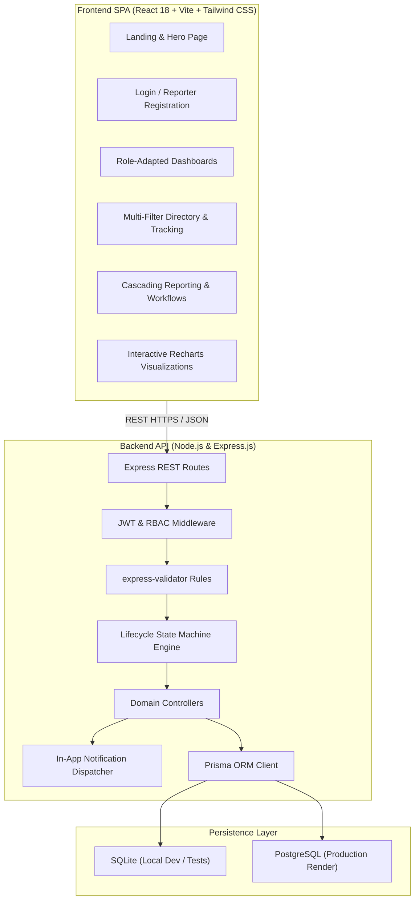
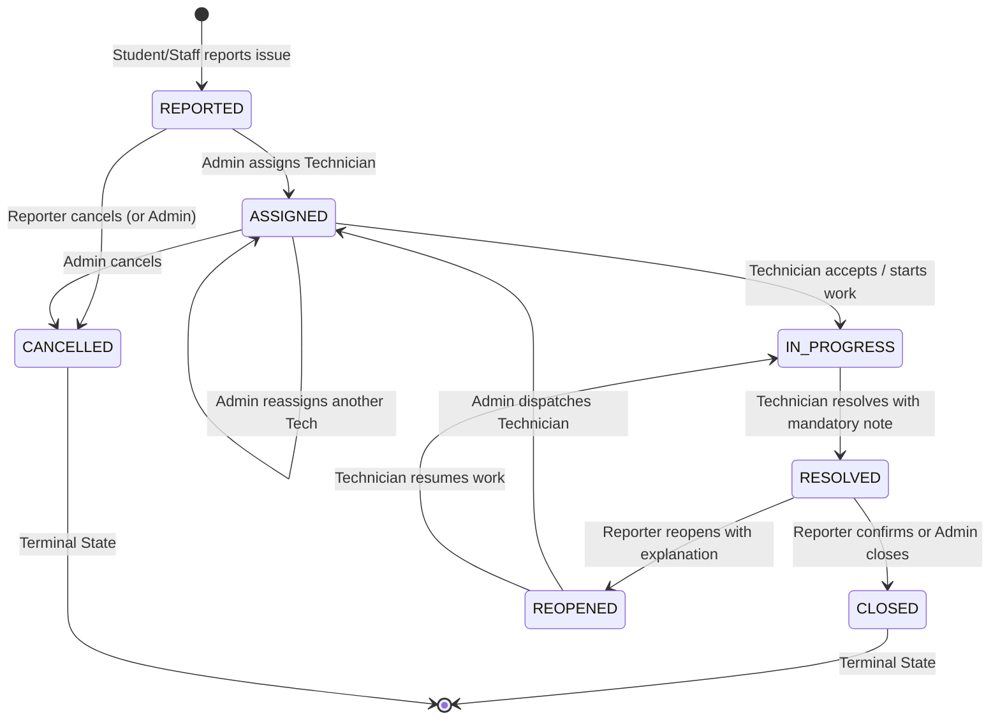
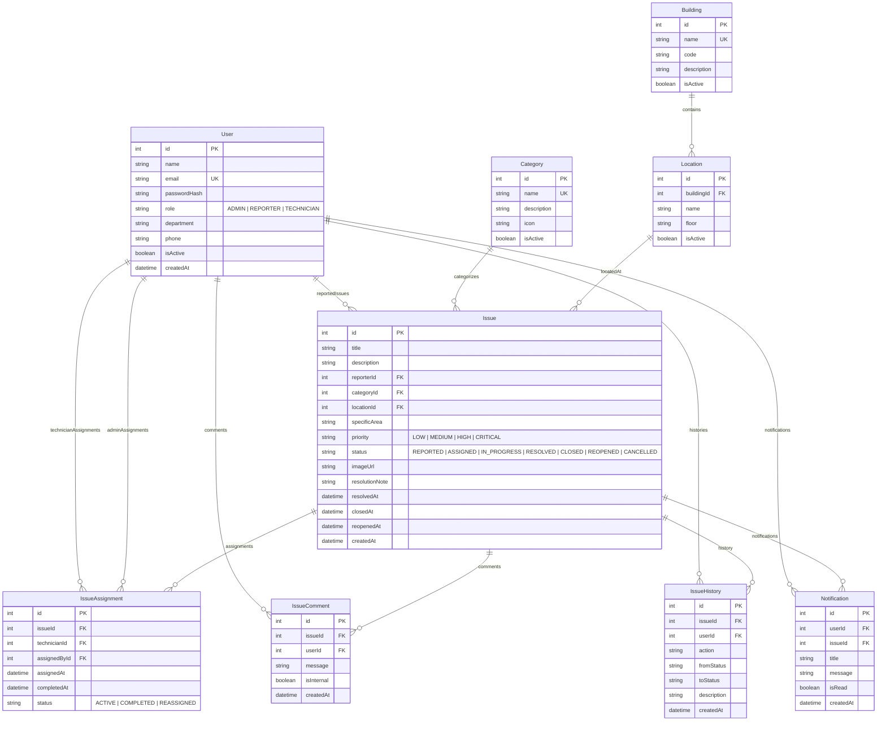

# CampusFix — Campus Maintenance & Issue Management Platform

<div align="center">


### *"Report. Resolve. Improve."*

**WD501 Advanced Backend Capstone Project**  
*A production-ready, centralized facility management and complaint resolution platform for college campuses.*

[](server/tests/campusfix.test.js)
[](https://nodejs.org)
[](https://expressjs.com)
[](https://www.prisma.io)
[](https://react.dev)
[](https://tailwindcss.com)
[](render.yaml)

</div>

---

## Table of Contents

1. [Project Overview](#project-overview)
2. [Problem Statement](#problem-statement)
3. [System Architecture](#system-architecture)
4. [User Roles & Permissions](#user-roles--permissions)
5. [Lifecycle State Machine](#lifecycle-state-machine)
6. [Database Schema & ER Diagram](#database-schema--er-diagram)
7. [Core Modules](#core-modules)
8. [RESTful API Reference](#restful-api-reference)
9. [Technology Stack](#technology-stack)
10. [Local Development Setup](#local-development-setup)
11. [Environment Variables](#environment-variables)
12. [Automated Testing](#automated-testing)
13. [Production Deployment (Render)](#production-deployment-render)
14. [Demo Walkthrough](#demo-walkthrough)
15. [Security Audit & Compliance](#security-audit--compliance)

---

## Project Overview

**CampusFix** is a centralized college campus maintenance and issue-management platform where students, faculty, and administrative staff can report infrastructure problems, track real-time repair progress, and communicate directly with assigned technicians. 

Unlike traditional informal complaint channels (e.g. lost emails, paper registers, or WhatsApp groups), CampusFix guarantees accountability, clear responsibility assignment, transparent SLA metrics, and a permanent historical audit trail for every light fixture, plumbing valve, network port, or laboratory workstation on campus.

---

## Problem Statement

Campus facilities face daily infrastructure disruptions:
- **Flickering lecture hall lights** and non-functional projectors disrupting academic lectures.
- **Water leakages** in dormitories and common washrooms causing safety hazards and resource wastage.
- **Damaged furniture and broken doors** compromising safety and classroom comfort.
- **Intermittent Wi-Fi access points** and broken Ethernet jacks hindering student research.

Without a centralized system, facility supervisors struggle to prioritize critical hazards, technicians lack clear job assignments with room specifics, and reporters are left unaware of whether their issues are being addressed. **CampusFix** eliminates these inefficiencies with a reliable, role-governed digital operations platform.

---

## System Architecture

CampusFix is built using a decoupled full-stack architecture with strict separation of concerns:



---

## User Roles & Permissions

The platform enforces three distinct user roles with server-side authorization:

| Capability | `ADMIN` | `REPORTER` | `TECHNICIAN` |
| :--- | :---: | :---: | :---: |
| Public Account Signup | ❌ (Admin Seeded) | ✅ | ❌ (Staff Created) |
| Report Campus Issue | ✅ | ✅ | ❌ |
| View All Campus Issues | ✅ | ✅ | ❌ (Assigned Only) |
| Assign / Reassign Technicians | ✅ | ❌ | ❌ |
| Accept Assignment & Start Work | ✅ | ❌ | ✅ (Assigned Only) |
| Submit Resolution Note & Complete | ✅ | ❌ | ✅ (Assigned Only) |
| Reopen Resolved Issue | ✅ | ✅ (Own Report) | ❌ |
| Confirm & Permanently Close | ✅ | ✅ (Own Report) | ❌ |
| Cancel Issue | ✅ | ✅ (If Still REPORTED) | ❌ |
| Add Public Comments / Work Notes | ✅ | ✅ (Public) | ✅ (Assigned Only) |
| Access Analytical Reports & KPIs | ✅ | ❌ | ❌ |
| Manage Categories & Campus Locations | ✅ | ❌ | ❌ |
| Manage User Directory & Activations | ✅ | ❌ | ❌ |

---

## Lifecycle State Machine

Issues progress through an explicit state machine preventing arbitrary or unauthorized status updates.



---

## Database Schema & ER Diagram

The database schema is defined in [`server/prisma/schema.prisma`](file:///c:/Users/mhasi/OneDrive/Desktop/501/server/prisma/schema.prisma) and features 9 interrelated relational models:



---

## Core Modules

### Module 1: Authentication & RBAC
- JWT Bearer authentication with configurable expiration.
- Bcrypt password hashing (10 salt rounds).
- Protected route guards with role checks (`authorize('ADMIN', 'TECHNICIAN')`).
- Deactivated user rejection on login and request interception.

### Module 2: Reporter Hub
- Personalized dashboard showing submission metrics (Total, Open, In Progress, Resolved, Critical).
- Fast action buttons: "Report New Issue", "My Reports", and "Campus Feed".
- Real-time status badge indicators.

### Module 3: Admin Operations Command
- KPI summary (total tickets, open tickets, resolution velocity, active staff).
- High & Critical Priority alert queue for fast triage.
- Instant access to user directory, categories, facilities, and analytical reports.

### Module 4: Issue Reporting & Cascading Venues
- Title, category, multi-paragraph description, severity, and optional image URL.
- **Cascading Location Dropdown**: Selecting a Building dynamically queries and populates only active rooms/areas within that building.
- Input validation ensuring deactivated categories/locations cannot be submitted.

### Module 5: Issue Lifecycle & State Machine
- Strict state transition enforcement implemented in [`stateMachine.js`](file:///c:/Users/mhasi/OneDrive/Desktop/501/server/src/utils/stateMachine.js).
- Prevents skipping stages (e.g. cannot jump from `REPORTED` directly to `RESOLVED`).

### Module 6: Technician Assignment & Workflows
- Admin assigns active technicians; previous active assignments automatically update to `REASSIGNED`.
- Technicians can view only their assigned issues (`scoped queries`).
- Technician workflow: Accept assignment -> Start work -> Log work notes -> Submit resolution note.

### Module 7: Chronological Audit Trail & Comments
- Immutable `IssueHistory` records every status transition, assignee change, priority update, and comment.
- Public comments for student-staff dialogue, plus internal work notes reserved for technician/admin collaboration.

### Module 8: Multi-Criteria Search & Filtering
- Server-side text search across title, description, and issue IDs.
- Multi-dimensional filters: Status, Priority, Category, Building, Technician, and Date range.
- Sorting by newest, oldest, highest priority, and recently updated.

### Module 9: User Directory & Safety Guards
- Role filter and user activation switches.
- **Safety Rule**: Administrators cannot deactivate their own accounts or revoke their own administrative privileges.

### Module 10: Category & Service Management
- Admin management of campus service domains.
- Soft-deactivation pattern preventing deletion if historical issues reference the category.

### Module 11: Campus Location Hierarchy
- Dynamic management of Buildings and Rooms.
- Hierarchical relation mapping: `Building` -> `Location` -> `Issue`.

### Module 12: In-App Notification Engine
- Event-triggered alerts on technician assignment, status updates, resolution, and reopening.
- Header notification bell with unread counter, single mark-as-read, and mark-all-read capabilities.

### Module 13: Reports & Analytics (Recharts)
- Real-time backend database queries (no hardcoded data).
- Bar charts for Category breakdown and Technician workload.
- Donut chart for active Lifecycle Statuses.
- Line chart for monthly resolution trends.

---

## RESTful API Reference

### Authentication
- `POST /api/auth/signup` — Register new student/staff reporter.
- `POST /api/auth/login` — Authenticate and receive JWT token.
- `POST /api/auth/logout` — Invalidate user session.
- `GET /api/auth/me` — Retrieve current authenticated user profile.
- `POST /api/auth/change-password` — Update user password with current password verification.

### Issues & Workflows
- `GET /api/issues` — Query issues with filters (`status`, `priority`, `categoryId`, `buildingId`, `search`, `sortBy`, `startDate`, `endDate`).
- `POST /api/issues` — Submit a new issue report.
- `GET /api/issues/:id` — Retrieve full issue details, relations, history, and comments.
- `PATCH /api/issues/:id` — Update issue metadata (priority, description).
- `POST /api/issues/:id/comments` — Add a discussion comment or internal work note.
- `POST /api/issues/:id/reopen` — Reopen a resolved issue (requires reason).
- `POST /api/issues/:id/close` — Permanently close a resolved issue.
- `POST /api/issues/:id/cancel` — Cancel an issue.

### Technician Assignment & Lifecycle Actions
- `POST /api/issues/:id/assign` — (Admin) Assign an active technician.
- `POST /api/issues/:id/accept` — (Technician/Admin) Accept assignment.
- `POST /api/issues/:id/start` — (Technician/Admin) Transition issue to `IN_PROGRESS`.
- `POST /api/issues/:id/resolve` — (Technician/Admin) Resolve issue (requires `resolutionNote`).

### Categories & Facilities
- `GET /api/categories` — List active categories (or all if `?all=true`).
- `POST /api/categories` — (Admin) Create category.
- `PATCH /api/categories/:id` — (Admin) Update category.
- `DELETE /api/categories/:id` — (Admin) Safely delete category if unused.
- `GET /api/buildings` — List campus buildings with room counts.
- `POST /api/buildings` — (Admin) Register campus building.
- `PATCH /api/buildings/:id` — (Admin) Update building details.
- `GET /api/locations` — List rooms (optionally filtered by `?buildingId=...`).
- `POST /api/locations` — (Admin) Create room under building.
- `PATCH /api/locations/:id` — (Admin) Update room.

### User Management & Notifications
- `GET /api/users` — (Admin) Search and filter user directory.
- `GET /api/users/technicians` — List active technicians for assignment dropdowns.
- `GET /api/users/:id` — (Admin) Get user account details.
- `PATCH /api/users/:id/status` — (Admin) Toggle active state or update role.
- `GET /api/notifications` — Fetch user notifications and unread count.
- `PATCH /api/notifications/:id/read` — Mark notification as read.
- `POST /api/notifications/read-all` — Mark all notifications as read.

### Analytics & Reports
- `GET /api/reports/overview` — KPI metrics, resolution rate, and average resolution hours.
- `GET /api/reports/categories` — Issue counts grouped by category.
- `GET /api/reports/locations` — Issue counts grouped by building.
- `GET /api/reports/technicians` — Workload distribution per technician.
- `GET /api/reports/trends` — Monthly / period reporting and resolution velocity.

### Health Check
- `GET /api/health` — Service health and timestamp diagnostics.

---

## Technology Stack

- **Backend:** Node.js, Express.js, Prisma ORM, JWT, Bcrypt.js, Express-Validator, Morgan, CORS.
- **Frontend:** React 18, Vite, React Router v6, Tailwind CSS, Lucide React, Recharts.
- **Databases:** SQLite (local development / testing), PostgreSQL (Render production).
- **Testing:** Vitest, Supertest.

---

## Local Development Setup

### 1. Prerequisites
- Node.js (v18 or higher)
- npm (v9 or higher)

### 2. Clone and Install Dependencies
```bash
# Install root, server, and client dependencies in one command
npm run install:all
```

### 3. Database Initialization & Idempotent Seeding
```bash
# Push Prisma schema to SQLite
npm run db:push

# Run the idempotent seed script
npm run seed
```

### 4. Start Full-Stack Development Servers
```bash
npm run dev
```
- **Backend API:** `http://localhost:5000`
- **Frontend SPA:** `http://localhost:5173`
- **Health Check:** `http://localhost:5000/api/health`

### 5. Pre-Seeded Demo Accounts

| Role | Email | Password |
| :--- | :--- | :--- |
| **Facility Administrator** | `admin@campusfix.edu` | `Admin@CampusFix2026` |
| **Student Reporter** | `rahul.sharma@campusfix.edu` | `Password123!` |
| **Faculty Reporter** | `dr.mehta@campusfix.edu` | `Password123!` |
| **Electrical Technician** | `vikram.electrician@campusfix.edu` | `Password123!` |
| **Plumbing Technician** | `suresh.plumber@campusfix.edu` | `Password123!` |
| **IT & Networks Tech** | `ananya.ittech@campusfix.edu` | `Password123!` |

*(Note: The login page also features one-click demo login buttons for instant evaluation)*

---

## Environment Variables

| Variable | Description | Default (Local) | Production Requirement |
| :--- | :--- | :--- | :--- |
| `PORT` | Backend listening port | `5000` | Set by Render (`10000`) |
| `NODE_ENV` | Runtime environment | `development` | `production` |
| `DATABASE_URL` | Prisma DB connection string | `file:./dev.db` | PostgreSQL URI |
| `JWT_SECRET` | Secret key for JWT signing | `campusfix_dev_secret_...` | **Strictly Required** (Refuses to start if missing) |
| `JWT_EXPIRES_IN` | Token validity duration | `7d` | `7d` |
| `CLIENT_URL` | Allowed CORS origin | `http://localhost:5173` | Production Frontend URL |
| `ADMIN_EMAIL` | Admin account seed email | `admin@campusfix.edu` | Configurable |
| `ADMIN_PASSWORD` | Admin initial seed password | `Admin@CampusFix2026` | Configurable / Auto-generated |
| `ADMIN_NAME` | Admin initial full name | `Campus Facilities Admin` | Configurable |

---

## Automated Testing

CampusFix includes a comprehensive integration test suite built with **Vitest** and **Supertest** covering 42 meaningful test cases:

```bash
# Run tests from server directory
npm test --prefix server
```

### Test Coverage Highlights:
- **Module 1 (Auth):** Signup, duplicate email rejection, login, invalid password, inactive user blocking, password change.
- **Module 2 (RBAC):** Anonymous access blocked, reporter blocked from admin users API, technician blocked from assigning issues, `/me` profile.
- **Module 3 (Issues):** Create issue, missing field validation, inactive category rejection, get by ID, technician reporting blocked.
- **Module 4 (Search & Filter):** Filter by status, filter by priority, text search across title/description, chronological sorting.
- **Module 5 (Assignments):** Admin assigns tech, inactive tech rejected, tech views assigned issue, tech blocked from unrelated issues.
- **Module 6 (State Machine):** Start work, invalid transition rejection (`IN_PROGRESS` -> `CLOSED`), missing resolution note rejection, successful resolution, reporter reopen, reporter cancel own issue.
- **Module 7 (Comments & Audit):** Add comment, empty message rejection, chronological `IssueHistory` preservation.
- **Module 8 (Notifications):** Fetch user alerts, mark single as read, mark all read.
- **Module 9 (Admin Users):** User directory filter, prevent self-deactivation of admin, toggle user active status.
- **Module 10 (Reports & Analytics):** Average resolution hours calculation, category aggregation, technician workload aggregation.
- **Module 11 (Diagnostics):** Health check response verification.

---

## Production Deployment (Render)

CampusFix is pre-configured for one-click deployment using Render's Infrastructure-as-Code blueprint [`render.yaml`](file:///c:/Users/mhasi/OneDrive/Desktop/501/render.yaml).

### Build & Startup Strategy
1. **Frontend Assets:** `npm install --include=dev --prefix client && npm run build --prefix client` builds Vite into `client/dist`.
2. **Provider Switcher:** `node server/scripts/switch-provider.js` dynamically updates `schema.prisma` from SQLite to PostgreSQL based on `DATABASE_URL`.
3. **Database Migration:** `prisma db push` syncs PostgreSQL tables without manual schema migrations.
4. **Startup:** `npm run seed && npm start` ensures idempotent database seeding before Express starts listening.
5. **Static SPA Serving:** Express serves `client/dist` directly, routing all non-API paths to `index.html`.

---

## Demo Walkthrough

To record or evaluate a complete demonstration of CampusFix:

1. **Platform Intro & Architecture:** Open `/`, showcase problem statement, role preview cards, and live metrics.
2. **Reporter Submission:**
   - Log in as Student (`rahul.sharma@campusfix.edu`).
   - Click "Report New Issue", fill in title, select "Electrical", choose "Academic Block A" -> "Room 204 Computer Lab", specify "Row 2 ceiling panel", set priority to "High".
   - Submit and review the newly generated issue detail page with status `REPORTED`.
3. **Admin Triage & Assignment:**
   - Sign in as Admin (`admin@campusfix.edu`).
   - Notice the new report in the urgent attention queue.
   - Click the issue, click "Assign Technician", select "Vikram Singh (Electrical Maintenance)".
   - Status transitions to `ASSIGNED` and is logged in the timeline.
4. **Technician Execution & Resolution:**
   - Sign in as Technician (`vikram.electrician@campusfix.edu`).
   - Check the notification bell ("You have been assigned to issue #...").
   - Click "Start Work" -> Status becomes `IN_PROGRESS`.
   - Post an internal technician note: "Testing voltage across fixture ballast."
   - Click "Mark Resolved", enter resolution note: "Replaced faulty electronic ballast and tested power draw. Operating normally."
   - Status updates to `RESOLVED` with resolution timestamp.
5. **Reporter Closure / Reopening:**
   - Switch back to the reporter account.
   - Check notification ("Your issue has been resolved. Note: ...").
   - Demonstrate the "Confirm & Close" workflow (or test the "Reopen" flow with reason).
6. **Analytics & Facility Reports:**
   - Return to Admin portal -> Navigate to "Analytics & Reports".
   - Review Recharts Category bar chart, Status donut chart, and Technician workload.
7. **Security & Validation Showcase:**
   - Try to log in with an inactive account -> blocked with 403.
   - Try to assign an issue to an inactive technician -> blocked with 400.
   - Try to skip states (e.g. resolve without work or without note) -> blocked with 400.

---

## Security Audit & Compliance

Before finalizing the application, a complete security audit was conducted:
- **No Hardcoded Secrets:** Production JWT secret and database credentials are read strictly from environment variables.
- **Fail-Safe JWT Verification:** The application refuses to start in `NODE_ENV=production` if `JWT_SECRET` is omitted.
- **Zero Password Exposure:** Passwords are never stored in plaintext and `passwordHash` is excluded from all API responses.
- **Authorization & Scoping:** Technicians cannot view or tamper with issues assigned to other staff; reporters can only cancel or close their own tickets.
- **Input Sanitization & Validation:** All routes use `express-validator` rules to prevent malformed payloads.
- **Production Error Handling:** Detailed stack traces are suppressed in production mode to avoid leaking internal architecture.

---

<div align="center">
  <p><strong>CampusFix — WD501 Advanced Backend Capstone Project</strong></p>
  <p>Engineered with precision for modern university campus operations.</p>
</div>
